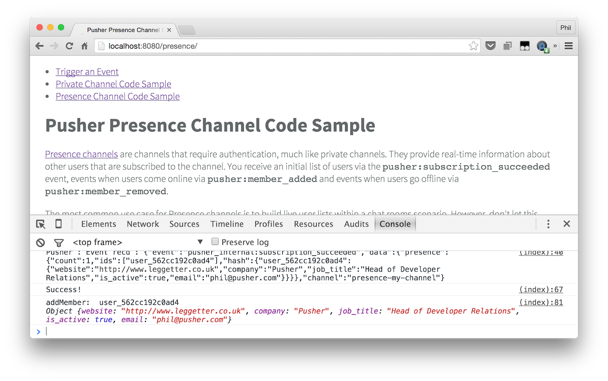

# Getting Started: Pusher and Node.JS

A getting started example when using the [Pusher Node.JS HTTP API library](https://github.com/pusher/pusher-http-node) with Express JS.

This repo gives you the absolute basics required to get started. It doesn't provide you with full examples so should be used as a quick getting started template or a reference.

## Examples

* [How to trigger an event from your server](views/trigger.html)
* [Using Private Channels](views/private.html)
* [Using Presence Channels](views/presence.html)
* How to receive and incoming WebHook

**Todo:**

* Triggering the same event on multiple channels
* How to trigger an event from your client (client events)
* Querying application state

## Installation

From the directory you've cloned into, install the example dependencies:

```
$ npm install
```

## Run the examples

Prior to running the Node app you'll need some environmental variables to be set.

* `PUSHER_CHAT_APP_ID` - your Pusher application ID
* `PUSHER_CHAT_APP_KEY` - your Pusher application key
* `PUSHER_CHAT_APP_SECRET` - your Pusher application secret

You can do this from the command line as part of running the application:

```bash
PUSHER_CHAT_APP_ID=YOUR_APP_ID PUSHER_CHAT_APP_KEY=YOUR_APP_KEY PUSHER_CHAT_APP_SECRET=YOUR_APP_SECRET node server.js
```

Or, probably much more easily, with the help of [foreman](https://github.com/ddollar/foreman) and by setting these values in a `.env` file:

```
PUSHER_CHAT_APP_ID=YOUR_APP_ID
PUSHER_CHAT_APP_KEY=YOUR_APP_KEY
PUSHER_CHAT_APP_SECRET=YOUR_APP_SECRET
```

Then run:

```bash
$ foreman start
```

Navigate to `localhost:5000` (or the URL you see logged to the console) and take a look at the examples. View the JavaScript console for a log from the Pusher JavaScript library.



## Deploy to Heroku

[](https://heroku.com/deploy)

Make sure you've got the required environmental variables set up!
